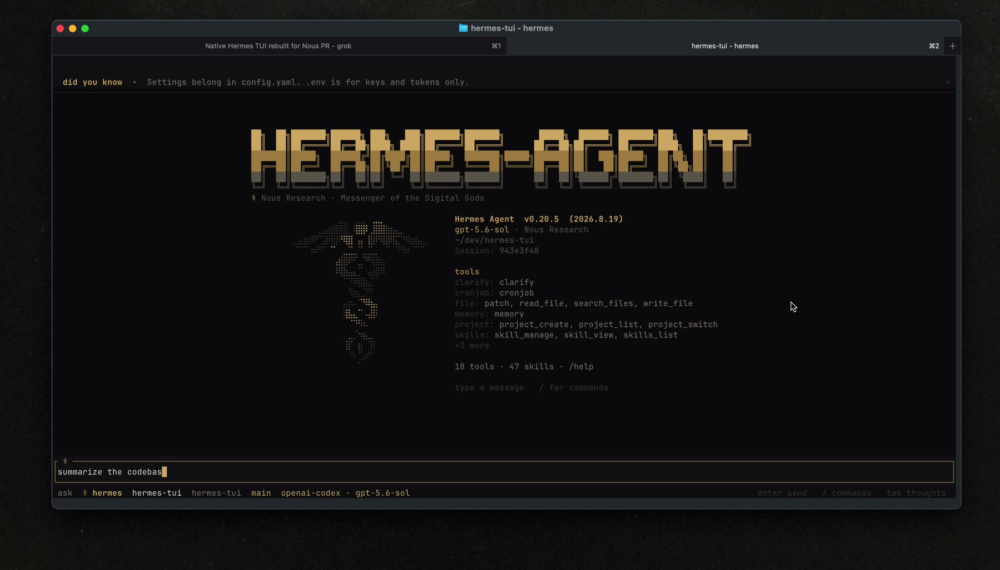
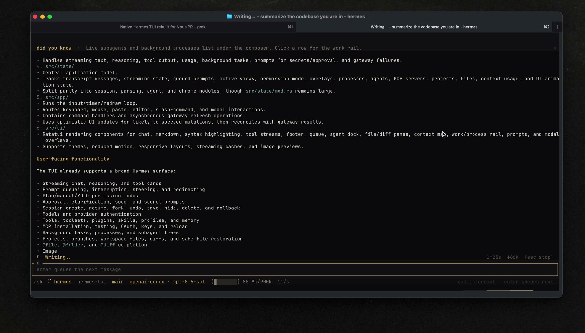
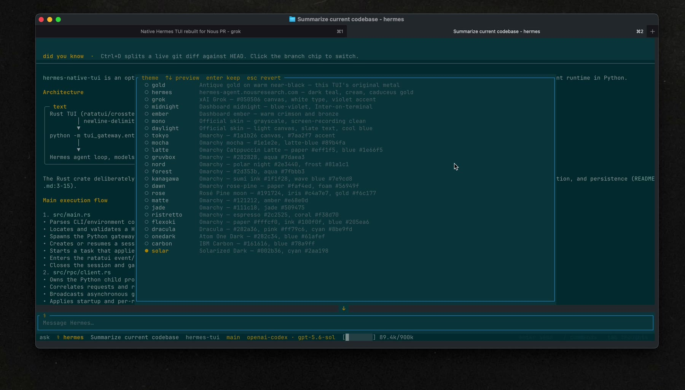
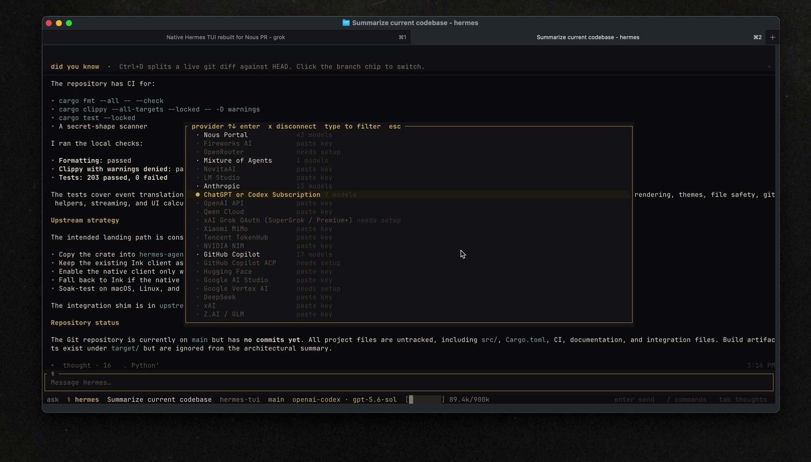

# hermes-native-tui

Native **Hermes TUI 2.0**: Rust owns the screen, Python still owns the agent.

Binary: `hermes-tui-native` (avoids colliding with the npm package `hermes-tui` in `ui-tui/`).

This crate is a second, opt-in screen client for the Ink TUI (`ui-tui/`). It is not a second agent and does not replace `hermes --tui`. Native is `hermes --tui --native` or `HERMES_TUI_NATIVE=1`. It speaks the same newline-delimited JSON-RPC:

```text
hermes-tui
  └─ python -m tui_gateway.entry
        └─ AIAgent + tools + sessions + memory + skills
```

Do not call model APIs from this crate. Turns, tools, slash fallthrough, YOLO, compress, and session lifecycle go through `tui_gateway`.

## 2.0 contract

| Layer | Owner |
|---|---|
| Draw, keys, mouse, themes, local overlays | this crate (ratatui) |
| Agent loop, tools, models, memory, skills, compress | `tui_gateway` |
| Launch env | same as Ink: `HERMES_PYTHON`, `HERMES_PYTHON_SRC_ROOT`, `HERMES_HOME` |

Ink extras that stay on the TypeScript client until they have a gateway-backed UI here: widgets, billing/subscription, voice, wake, pet, dashboard PTY embed, Telegram/Claude handoff.

## Screenshots

Caduceus gold, a live stream, `/theme`, `/model`.









## Run

```bash
cargo install --path crates/tui
hermes --tui --native
```

From this crate (directory that contains `tui_gateway/entry.py`):

```bash
export HERMES_PYTHON_SRC_ROOT=/absolute/path/to/hermes-agent
export HERMES_PYTHON=$HERMES_PYTHON_SRC_ROOT/.venv/bin/python
export HERMES_HOME=~/.hermes
cargo run --release
```

```text
hermes-tui-native [--python PATH] [--src-root PATH] [--hermes-home PATH] [--cwd PATH] [--title TEXT] [--resume ID]
```

`--resume` / `HERMES_TUI_RESUME` matches Ink. Interpreter resolution matches `ui-tui/src/gatewayClient.ts`.

Ink stays `hermes --tui`. Native is opt-in (`HERMES_TUI_NATIVE=1` / `--native`). If the binary is missing, the CLI falls back to Ink. See `CONTRIBUTING.md`.

## Surfaces (gateway)

| Surface | RPC / event |
|---|---|
| Chat + tools + CoT | `prompt.submit` → `thinking.delta` / `reasoning.delta` / `message.delta` / `tool.*` |
| Interrupt / steer | `session.interrupt`, `session.steer` |
| YOLO / plan / ask | `config.set` `yolo` · Shift+Tab cycles plan → ask → yolo; plan auto-denies approvals |
| MCP | `mcp.servers.list` / `mcp.catalog` / `reload.mcp` — `/mcp` |
| `!` shell | `shell.exec` — output shown and attached to the next send |
| Session fork | `session.branch` — `/fork` `/branch` |
| Undo last turn | `session.undo` — `/undo` |
| Save transcript | `session.save` — `/save` |
| Tools / plugins | `tools.list` / `plugins.list` |
| Terminal backend | `session.info.terminal_backend` — footer chip when not local; `/sandbox` |
| Model / branch | `model.options`, `session.cwd.set` |
| Slash intellisense | `commands.catalog` + local commands |
| Skills | `skills.manage` list + local `SKILL.md` preview |
| Sessions | `session.list` / `session.resume` |
| Profiles / agents / memory | `profiles.list`, `agents.list`, `delegation.*` / `subagent.*`, `learning.frames` |
| Context map | `session.context_breakdown` + `session.compress` |
| Approvals / clarify / sudo / secret | matching `*.respond` |
| Files + per-file diff | local tree + `git` (Ctrl+E) |
| `@file` / `@diff` / `@folder` | `complete.path` — Tab fills, gateway expands on send |
| Image attach | `image.attach` + half-block preview; paste a `.png` path |
| Paste collapse | long paste → `[[ head .. N lines .. tail ]]`; click for full preview |
| Rollback | `rollback.list` / `diff` / `restore` — `/rollback` |
| Background | `prompt.background` — `/background` `/bg` `/btw` picker; footer `▶ N` while running |
| Subagents | `subagent.*` events + `/agents` tree — p pause  x stop  X subtree  s steer; footer `◆ N` |
| Processes | work rail Ctrl+W `/work` — list + output; `d` git diff --check; `x` kill; footer `▸ N` |

Composer: Enter send, Shift+Enter newline, `!cmd` runs `shell.exec`, `/editor` opens `$VISUAL`/`$EDITOR`, queue while busy, `↓` jump-to-tail when scrolled up. Ctrl+P command palette. `/paste` `/image` attach pictures. `/reload` re-reads `.env`. `/mouse` releases capture for tmux. `/init` writes `AGENTS.md`. `/export` copies the transcript.

Likely-to-succeed mutations (YOLO, interrupt, send, model, pause, file restore, `/clear`) paint immediately, then reconcile with the gateway. Failure rolls the UI back or offers `u` Undo, and the toast says how to retry. Loaders use `…`, skip a flash under 180ms, and stay at least 400ms once painted. Esc/`/exit` twice if a draft or queue would be lost. `/motion` toggles looping chrome (`/motion off`, `/motion on`). `HERMES_TUI_REDUCED_MOTION=1` (or `PREFERS_REDUCED_MOTION`) is the env default.

## Develop

```bash
cargo fmt --all -- --check
cargo clippy --all-targets --locked -- -D warnings
cargo test --locked
```

Do **not** flip `hermes --tui` to this client until it has soak time. See `CONTRIBUTING.md`.
