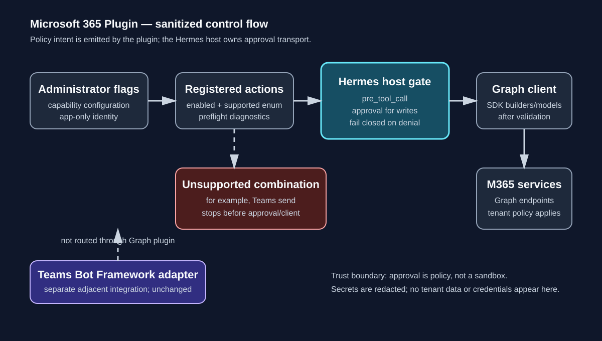

# Microsoft 365 Plugin

The **Microsoft 365 Plugin** turns a single Hermes workflow into bounded Graph operations across the Microsoft 365 services that this repository implements. For example, an assistant can find an Outlook message, inspect a related OneDrive file, and create a calendar event without the operator wiring three unrelated integrations. The plugin does not claim complete coverage of Microsoft Graph.

## Why one plugin

Outlook, SharePoint, OneDrive, Calendar, Teams, Microsoft To Do, and Planner share the same integration boundary: Microsoft Entra application identity, Graph SDK client construction, operation/permission resolution, host approval intent, preflight reporting, request bounds, and result redaction. Keeping that boundary together makes capability flags and security behavior consistent while preserving separate service contracts internally. The existing Teams Bot Framework adapter and `teams_pipeline` are separate and unchanged; they are not replaced by Graph operations.

## Capability matrix

The table is the model-facing contract for the implemented `client_credentials` / application-permission mode. `required` means the listed Graph application role is needed and tenant administrator consent is normally required; local preflight does not contact the tenant.

| Service | Operation | Auth mode | Permission | Approval | Status | Notes |
|---|---|---|---|---|---|---|
| Outlook | `search` | app-only | `Mail.Read` | none | implemented | Bounded collection request with a subject filter. |
| Outlook | `read` | app-only | `Mail.Read` | none | implemented | Reads a user message. |
| Outlook | `create_draft` | app-only | `Mail.ReadWrite` | host gate | implemented | Creates a draft. |
| Outlook | `send` | app-only | `Mail.Send` | host gate | implemented | Sends a new message; sending an existing message ID is retained by the handler contract. |
| SharePoint | `search` | app-only | `Sites.Read.All` | none | implemented | Searches the selected site drive. |
| SharePoint | `read` | app-only | `Sites.Read.All` | none | implemented | Reads a relative drive-item path. |
| SharePoint | `download_files` | app-only | `Files.Read.All` | none | implemented | Returns bounded base64, up to 10 MiB. |
| SharePoint | `upload_files` | app-only | `Files.ReadWrite.All` | host gate | implemented | Uploads bounded base64 bytes through the SDK content builder. |
| OneDrive | `search` | app-only | `Files.Read.All` | none | implemented | Searches the user drive. |
| OneDrive | `read` | app-only | `Files.Read.All` | none | implemented | Reads a relative drive-item path. |
| OneDrive | `download_files` | app-only | `Files.Read.All` | none | implemented | Returns bounded base64, up to 10 MiB. |
| OneDrive | `upload_files` | app-only | `Files.ReadWrite.All` | host gate | implemented | Uploads bounded base64 bytes through the SDK content builder. |
| Calendar | `search` | app-only | `Calendars.Read` | none | implemented | Bounded collection request with a subject filter. |
| Calendar | `create_events` | app-only | `Calendars.ReadWrite` | host gate | implemented | Creates an event from the supplied fields. |
| Calendar | `update_events` | app-only | `Calendars.ReadWrite` | host gate | implemented | Sends a partial event patch. |
| Teams | `list_teams` | app-only | `Team.ReadBasic.All` | none | implemented | Lists joined teams. |
| Teams | `list_channels` | app-only | `Channel.ReadBasic.All` | none | implemented | Lists channels for a team. |
| Teams | `search_messages` | app-only | `Chat.Read.All`, `ChannelMessage.Read.All` | none | implemented | Uses the generated Graph search request models. |
| Teams | `send_messages` | app-only | none claimed | host gate | unsupported | Retained in administrative operation definitions, but blocked before approval/client creation because delegated auth is required and not implemented. |
| Microsoft To Do | `list_task_lists` | app-only | `Tasks.Read.All` | none | implemented | To Do list collection. |
| Microsoft To Do | `search` | app-only | `Tasks.Read.All` | none | implemented | Task collection query with a bounded request. |
| Microsoft To Do | `read` | app-only | `Tasks.Read.All` | none | implemented | Reads a task in a To Do list. |
| Microsoft To Do | `create_tasks` | app-only | `Tasks.ReadWrite.All` | host gate | implemented | Creates a To Do task. |
| Microsoft To Do | `update_tasks` | app-only | `Tasks.ReadWrite.All` | host gate | implemented | Sends a partial task patch. |
| Microsoft Planner | `list_plans` | app-only | `Group.Read.All` | none | implemented | Uses Planner plan builders, not To Do builders. |
| Microsoft Planner | `list_buckets` | app-only | `Group.Read.All` | none | implemented | Lists buckets for a plan. |
| Microsoft Planner | `list_tasks` | app-only | `Group.Read.All` | none | implemented | Lists tasks for a plan. |
| Microsoft Planner | `read` | app-only | `Tasks.Read.All` | none | implemented | Reads a Planner task. |
| Microsoft Planner | `create_tasks` | app-only | `Tasks.ReadWrite.All` | host gate | implemented | Creates a Planner task. |
| Microsoft Planner | `update_tasks` | app-only | `Tasks.ReadWrite.All` | host gate | implemented | Updates a Planner task. |

The administrative `OPERATIONS` catalog intentionally retains the full requested operation set, including `teams.send_messages`. Unsupported combinations are not advertised in the active model action enum and are rejected by the support resolver before credentials or a Graph client are constructed.

## Architecture



The diagram is explanatory, not a sandbox or a substitute for the host policy implementation. Writes emit a `pre_tool_call` approval directive; Hermes resolves that directive. The plugin does not call the approval transport directly.

## Configuration

Enable only the supported operations you need. User-resource operations require an actual Graph user ID; `me` is not valid for this app-only client. SharePoint selections use `site_id` and do not require `user_id` for local readiness.

```yaml
tenant_id: "00000000-0000-0000-0000-000000000000"
client_id: "11111111-1111-1111-1111-111111111111"
# Supply through Hermes secret handling; never commit a real value.
client_secret: "<secret-managed-by-Hermes>"
user_id: "22222222-2222-2222-2222-222222222222"
capabilities:
  outlook:
    search: true
    send: true
  onedrive:
    download_files: true
    upload_files: true
  calendar:
    create_events: true
  teams:
    search_messages: true
  todo:
    list_task_lists: true
  planner:
    list_plans: true
```

`client_secret` is marked `secret: true` in `plugin.yaml`. Runtime lookup first accepts the plugin context value and can fall back to Hermes' `agent.secret_scope` environment-backed reader (`MICROSOFT365_CLIENT_SECRET`). Results and preflight configuration redact the secret. This README does not claim that every deployment persists plugin configuration encrypted; operators should use the canonical Hermes secret scope rather than putting a plaintext secret in a checked-in file.

## Preflight and authentication

`microsoft365_preflight` is a side-effect-free local diagnostic. Its `ready` / `locally_ready` result means only that required local fields, selected supported operations, and optional SDK availability are satisfied. It does **not** authenticate, verify Graph permissions, verify tenant admin consent, or test connectivity. It reports those dimensions as `not_tested` and reports admin consent as `required` when capabilities are selected. Nothing in the current registration path claims that preflight runs automatically before a configuration save or apply.

Only application-only client-credentials authentication is implemented. Delegated authorization-code, device-code, and delegated Planner/To Do flows are planned/open work, not hidden fallbacks. Official endpoint and permission references are maintained in [`references/graph-permissions.md`](references/graph-permissions.md).

## Contracts and trust boundaries

- Uploads accept strict base64, preserve empty files, require a relative UTF-8 path, reject empty/`.`/`..` segments and backslash traversal, and reject payloads over 10 MiB before client creation.
- Downloads return base64 plus size, content type, and path, bounded at 10 MiB; arbitrary local destinations and large-file upload sessions are not supported.
- Collection requests are bounded to 1–100 items and search inputs are escaped for the generated request configuration.
- `safe_result()` bounds depth, collection size, and strings; redacts secret-like keys, headers, request/response data, cycles, and binary payloads.
- Host approval is a policy chokepoint, not a security sandbox. It does not replace Microsoft Graph permissions, tenant policy, endpoint authorization, or filesystem isolation outside this plugin contract.
- Teams Bot Framework and `teams_pipeline` remain separate adapters; this plugin does not claim to preserve their runtime behavior through Graph.

## Support status and limits

**Implemented:** the matrix above, official `msgraph-sdk` builders/models, application-permission reporting, bounded file transfer, operation-level configuration, and host approval directives for writes.

**Unsupported:** `teams.send_messages` in app-only mode. It remains in administrative definitions so the requested capability is visible and auditable, but cannot reach approval, client creation, or network activity.

**Planned/open:** delegated authentication, remote permission/connectivity verification, automatic save/apply preflight wiring, large-file upload sessions, broader Graph resource coverage, and a compatibility matrix beyond the tested `msgraph-sdk>=1.62.0,<2` range. Planner means actual Planner builders; it is distinct from Microsoft To Do.

## Reproducible verification

Run from the repository root with the project interpreter:

```bash
py -3.11 -m pytest tests/plugins/test_microsoft365_plugin.py -q
py -3.11 -m pytest tests/plugins/test_microsoft365_tasks_6_12.py -q
py -3.11 -m pytest tests/tools/test_microsoft_graph_client.py tests/tools/test_microsoft_graph_auth.py -q
py -3.11 -m hermes_cli.plugin_validate plugins/microsoft365/plugin.yaml
py -3.11 -m compileall -q plugins/microsoft365
git diff --check origin/main...HEAD
```

The repository's tests use fake SDK-shaped builders and fictional values; they make no tenant or network calls. See `.hermes/evidence/microsoft365-final-checklist.md` for the acceptance mapping and observed command results.
